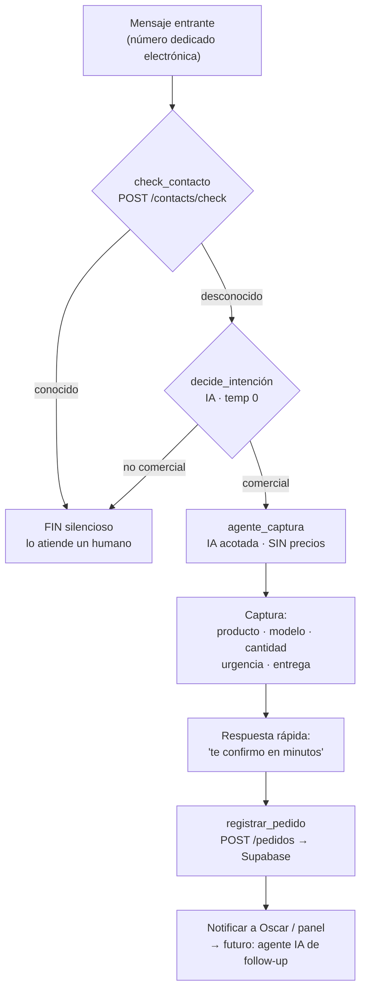

# PLAN — shoppingaycelectronica.com

Marketplace de electrónica (AYC Electrónica S.R.L. · Mercado 4) con **WhatsApp
automático** y catálogo optimizado para **SEO + GEO**. Objetivo de mediano plazo:
**productizarlo como SaaS** para otros centros comerciales.

> Documento vivo de **visión y fases**. La **torre de control** (estado real de
> producción) es `docs/ESTADO.md` — si algo acá difiere de la realidad, manda ESTADO.
> ⚠️ **Realidad hoy:** el número de WhatsApp es **Coexistence** sobre la línea
> personal de Oscar; la "línea dedicada API-only" de más abajo es el **plan**, aún
> no existe. Todo agente/LLM lee esto y `AGENTS.md` antes de tocar nada.

---

## 1. Decisiones tomadas (cerradas)

1. **Número de WhatsApp dedicado y API-only** (no coexistencia): línea nueva
   exclusiva de electrónica. No se mezcla con aycweb / muebles / metalurgia /
   logística. Máquina enfocada = analíticas limpias.
2. **Repo separado + Supabase propio**: base de datos NO atada a AYCweb, para
   poder empaquetar y vender el sistema a otros shoppings.
3. **Catálogo propio, NO scraping** en tiempo real. El activo durable es nuestra
   base estructurada de productos. El scraping queda descartado como base.
4. **Follow-up Fase 1**: el bot captura y notifica a un panel/humano para el
   cierre — pero **la DB y el flujo se diseñan desde hoy para que un agente IA
   autónomo tome ese seguimiento muy pronto**.
5. **Constitución desde el día 1**: se copian `AGENTS.md` y `docs/ESTADO.md` de
   AYCweb al repo nuevo.

## 2. Fases

| Fase | Qué | Objetivo | Entregable |
|---|---|---|---|
| **0 — Setup** | Número dedicado API-only + Kapso; scaffold repo; proyecto Supabase propio | Base limpia y separada | Scaffold + constitución |
| **1 — Allow-list + captura** | Bot engancha **solo a no-agendados**, captura pedido (neuroventas), notifica | **Validar demanda sin catálogo ni precios** | Endpoints + workflow + tablas |
| **2 — Catálogo (activo)** | Productos reales de inquilinos, estructurado SEO/GEO (`schema.org`) | Construir el moat | Sitio + `productos` |
| **3 — Bot cotiza del catálogo** | WhatsApp cotiza al instante desde nuestra base | Cerrar rápido | Integración |
| **4 — Agente IA de ventas + escala** | Agente autónomo de follow-up; más inquilinos; empaquetar SaaS | Producto | Multi-tenant |

> **Fase 1 NO cotiza precios** (todavía no hay catálogo). El bot solo engancha,
> entiende qué busca, captura y promete respuesta rápida. Riesgo de alucinar
> precios = nulo.

## 3. Arquitectura

- **Repo nuevo** (este), independiente de aycweb. Reusa patrones de AYCweb
  (Next.js, endpoints `/api/integrations/kapso/*` con secreto, cliente Supabase
  server-side con service role, tests con Vitest).
- **Supabase propio** (proyecto nuevo): su propia `SUPABASE_URL` +
  `SUPABASE_SERVICE_ROLE_KEY`. Nunca se exponen al cliente (sin `NEXT_PUBLIC_`).
- **Kapso** apunta a los endpoints de este sitio (no escribe a Supabase directo:
  la service key vive solo en Vercel). Auth por `x-kapso-webhook-secret`
  (== `KAPSO_WEBHOOK_SECRET`), comparación timing-safe.
- **Número dedicado**: al ser línea nueva sin app personal, **"dedicated"
  (API-only) es correcto** — mejor throughput, sin la restricción de coexistencia
  del +595 personal.

Variables de entorno (nombres, no valores):
`SUPABASE_URL`, `SUPABASE_ANON_KEY`, `SUPABASE_SERVICE_ROLE_KEY`,
`KAPSO_API_KEY`, `KAPSO_WEBHOOK_SECRET`, `KAPSO_PHONE_NUMBER_ID`.

## 4. Allow-list de contactos agendados

Kapso/WhatsApp Cloud API **NO conoce la agenda del teléfono**. Para "responder
solo a no-agendados" mantenemos **nuestra propia lista** y el workflow la consulta.

**Tabla `contactos_conocidos`:**

```sql
create table public.contactos_conocidos (
  id          uuid primary key default gen_random_uuid(),
  whatsapp    text unique not null,   -- NORMALIZADO: solo dígitos con país (595...)
  nombre      text,
  categoria   text,                   -- familia | amigo | cliente | proveedor | ...
  fuente      text,                   -- import | manual | auto
  created_at  timestamptz default now(),
  updated_at  timestamptz default now()
);
create index on public.contactos_conocidos (whatsapp);
alter table public.contactos_conocidos enable row level security;
```

**Endpoint de chequeo** (mismo patrón que leads):
```
POST /api/integrations/kapso/contacts/check   (auth: x-kapso-webhook-secret)
body: { whatsapp }  →  { known: boolean }
```

**Tres detalles críticos:**
1. **Normalización**: normalizar igual al sembrar y al consultar (sin `+`, sin
   espacios, con código país). Causa #1 de fallo si no se hace.
2. **Siembra**: export de Google Contacts / WhatsApp → import. Las **etiquetas de
   WhatsApp** (Familia, Cliente…) alimentan `categoria`.
3. **Fail-open**: si el endpoint no responde → tratar como **desconocido y
   enganchar** (perder un prospecto es peor que saludar a un conocido). Switch
   de config.

**Loop**: cuando un lead se vuelve cliente → se agrega a `contactos_conocidos`
→ el bot deja de auto-engancharlo.

## 5. Workflow de captura de pedidos (Kapso)

```
trigger: inbound_message (NÚMERO DEDICADO electrónica)

start
 └→ check_contacto  (function → POST /contacts/check)
     ├─ conocido    → FIN silencioso (lo atiende un humano)
     └─ desconocido → decide_intencion (comercial / no-comercial · IA temp 0)
             ├─ no_comercial → FIN silencioso
             └─ comercial → agente_captura (IA acotada, SIN cotizar)
                   1) saludo cálido + "¿qué estás buscando?"
                   2) captura: producto · marca/modelo · cantidad · urgencia · entrega
                   3) "Te confirmo precio y disponibilidad en unos minutos 👍"
                   4) registrar_pedido → POST /api/integrations/kapso/pedidos
                   5) notificar a Oscar / panel  (→ futuro: agente IA de follow-up)
```



## 6. Modelo de datos — `pedidos_electronica` (diseñado para el agente IA autónomo)

La state-machine y los campos de seguimiento existen desde el día 1 para que un
agente autónomo pueda tomar el follow-up sin migración.

```sql
create table public.pedidos_electronica (
  id                uuid primary key default gen_random_uuid(),
  created_at        timestamptz default now(),
  updated_at        timestamptz default now(),

  -- Idempotencia del webhook de Kapso
  source            text default 'kapso',
  conversation_id   text,
  message_id        text,

  -- Contacto
  whatsapp          text,
  nombre            text,

  -- Pedido
  producto          text,
  marca_modelo      text,
  cantidad          integer,
  urgencia          text,      -- alta | media | baja
  entrega           text,      -- zona | retiro | envío
  resumen           text,

  -- Pipeline de ventas (state machine)
  estado            text default 'nuevo',   -- nuevo|contactado|cotizado|negociando|ganado|perdido
  asignado_a        text,                    -- 'humano:<id>' | 'agente-ia' | null
  lead_score        integer,                 -- 0-100

  -- Seguimiento autónomo (lo lee/escribe el agente IA)
  last_contacted_at timestamptz,
  next_follow_up_at timestamptz,             -- cuándo reintentar
  follow_up_count   integer default 0,
  follow_up_max     integer default 4,
  transcript        jsonb,                   -- conversación
  metadata          jsonb
);

create unique index uq_pedidos_idem
  on public.pedidos_electronica (source, conversation_id, message_id);
create index on public.pedidos_electronica (estado, next_follow_up_at);
alter table public.pedidos_electronica enable row level security;
```

El agente autónomo de Fase 4 consultará algo como:
`estado in ('contactado','cotizado','negociando') and next_follow_up_at <= now()`
y actuará (mensaje de seguimiento, actualizar estado, agendar el próximo intento).

## 7. Principios de neuroventas para la captura (prompt del agente)

- **Directo**: una sola pregunta por mensaje, sin rodeos.
- **Empático**: reflejar lo que pide; tono humano paraguayo (voseo); nada de
  frases robóticas.
- **Baja fricción**: no pedir datos de más; el teléfono ya lo tenemos; máx 2-3
  preguntas antes de capturar.
- **Valor rápido**: confirmar que lo vas a ayudar + dar un tiempo concreto ("en
  minutos").
- **Siguiente paso siempre claro**: nunca cerrar sin un próximo paso.
- **Regla de oro**: prohibido cotizar de memoria (no hay catálogo en Fase 1).

## 8. Panel / notificación (Fase 1) → agente autónomo (futuro)

- Fase 1: notificación a Oscar (WhatsApp/email) + un panel simple `/admin/pedidos`
  (leer `pedidos_electronica` por estado) donde un vendedor humano cierra.
- Futuro: agente IA de follow-up que trabaja la cola por `next_follow_up_at`.
  La DB ya lo soporta.

## 9. Catálogo + GEO (Fase 2, resumen)

- Tabla `productos` estructurada (marca, modelo, specs, precio, stock, inquilino).
- Páginas por producto con `schema.org` Product/Offer, crawleables.
- GEO = ser la **fuente más limpia y factual** → los motores de IA nos recomiendan.
  No se compra; se gana con datos estructurados.

## 10. Primer PR (#36) — alcance

1. Scaffold del repo (Next.js) + `AGENTS.md` + `docs/ESTADO.md` + este `PLAN.md`.
2. SQL: `contactos_conocidos` + `pedidos_electronica`.
3. Endpoints: `/api/integrations/kapso/contacts/check` y `/api/integrations/kapso/pedidos`
   (auth por secreto, service role server-side, idempotente) + tests Vitest.
4. Borrador del workflow Kapso (`kapso/`) — draft, trigger inactivo, número sandbox.

## 11. Pendiente MANUAL de Oscar

- Adquirir/asignar la **línea nueva** y conectarla a Kapso (API-only).
- Crear el **proyecto Supabase nuevo** y cargar sus env vars en Vercel.
- Generar `KAPSO_WEBHOOK_SECRET` (Vercel + Kapso).
- Exportar contactos para **sembrar `contactos_conocidos`**.
